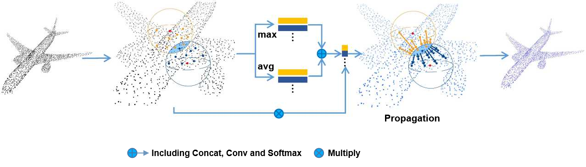

# LocalContextPropagation

This repo is an implementation of [LCPFormer: Towards Effective 3D Point Cloud Analysis via Local Context Propagation in Transformers](https://ieeexplore.ieee.org/document/10049597) (IEEE Transactions on Circuits and Systems for Video Technology)



## Install

install [PointNet++](https://arxiv.org/abs/1706.02413) layers:

```
cd pointnet2
python setup.py install --user
cd ..
```
